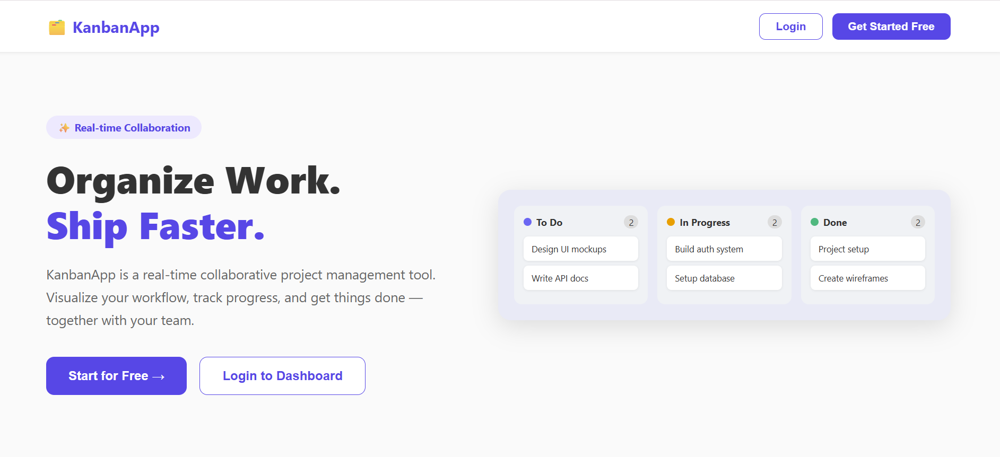
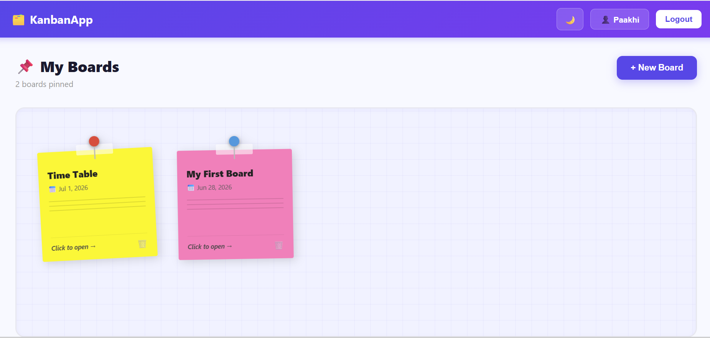
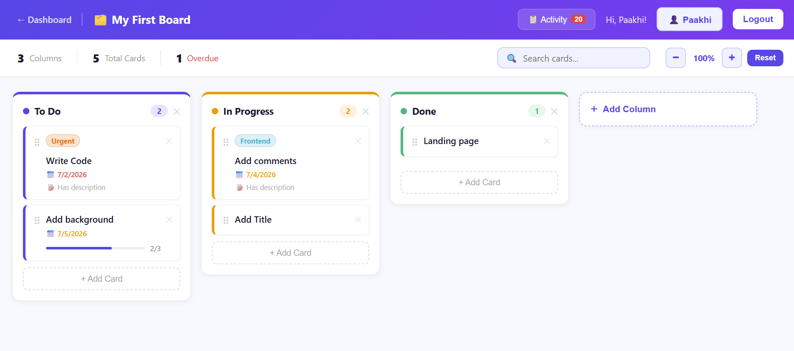

# 🗂️ KanbanApp — Real-Time Collaborative Project Management Tool

> A full-stack real-time Kanban board application with drag & drop, live collaboration, card checklists, labels, activity logs, and more. Built with React, Node.js, PostgreSQL, and Socket.io.

## 🌐 Live Demo

[Live App](https://kanban-app.vercel.app) *(Coming Soon)*

Backend API: *(Coming Soon)*

---

## 📸 Screenshots

| Landing Page | Dashboard | Kanban Board |
|-------------|-----------|--------------|
|  |  |  |

---

## ✨ Features

| Feature | Description |
|---------|-------------|
| 🔐 **JWT Authentication** | Secure register & login with bcrypt password hashing |
| 📌 **Sticky Note Dashboard** | Colorful pinned boards with hover effects and inline renaming |
| 🗂️ **Multiple Boards** | Create and manage unlimited project boards |
| 📋 **Kanban Columns** | Custom columns with color-coded accent borders |
| 🃏 **Cards** | Add, edit, delete cards with title, description, and due dates |
| 🖱️ **Drag & Drop** | Smooth card movement between columns using @dnd-kit |
| ⚡ **Real-Time Sync** | All changes appear instantly for every user via Socket.io |
| 🏷️ **Card Labels** | Color-coded labels like Bug, Feature, Urgent, Design, and more |
| ✅ **Card Checklist** | Subtasks with checkboxes and a live progress bar |
| 🔍 **Search & Filter** | Search cards across all columns with highlighted results |
| 📋 **Activity Log** | Full history of every action with timestamps |
| 📅 **Due Dates** | Set deadlines with overdue indicators in red |
| 🔍 **Zoom In/Out** | Scale the board to fit all columns on screen |
| 🌙 **Dark Mode** | Toggle between light and dark themes with CSS variables |
| 👤 **Profile Page** | Update name, change password with strength indicator, delete account |
| 🚀 **Landing Page** | Professional marketing page explaining the product |

---

## 🛠️ Tech Stack

### Frontend
| Technology | Purpose |
|-----------|---------|
| React + Vite | Fast modern frontend framework |
| React Router | Client-side routing with protected routes |
| Socket.io Client | Real-time bi-directional updates |
| @dnd-kit | Accessible drag and drop |
| Axios | HTTP client with JWT interceptors |
| CSS Variables | Light/dark theming system |

### Backend
| Technology | Purpose |
|-----------|---------|
| Node.js + Express | REST API server |
| Socket.io | WebSocket server for real-time events |
| PostgreSQL + pg | Relational database |
| JWT + bcrypt | Secure authentication |
| dotenv | Environment variable management |

---

## 🚀 Getting Started Locally

### Prerequisites
- Node.js v18+
- PostgreSQL v14+

### 1. Clone the repository
```bash
git clone https://github.com/PaakhiKataria/kanban-app.git
cd kanban-app
```

### 2. Set up the database
```bash
psql -U postgres
CREATE DATABASE kanban_db;
\q
psql -U postgres -d kanban_db -f server/config/schema.sql
```

Also run these for labels and checklist tables:
```bash
psql -U postgres -d kanban_db
CREATE TABLE IF NOT EXISTS labels (id SERIAL PRIMARY KEY, card_id INTEGER REFERENCES cards(id) ON DELETE CASCADE, text VARCHAR(50) NOT NULL, color VARCHAR(20) NOT NULL);
CREATE TABLE IF NOT EXISTS checklist_items (id SERIAL PRIMARY KEY, card_id INTEGER REFERENCES cards(id) ON DELETE CASCADE, text VARCHAR(255) NOT NULL, completed BOOLEAN DEFAULT false, position INTEGER DEFAULT 0, created_at TIMESTAMP DEFAULT NOW());
\q
```

### 3. Set up the backend
```bash
cd server
npm install
```

Create a `.env` file in the `server` folder:
```env
PORT=5000
DB_USER=postgres
DB_HOST=localhost
DB_NAME=kanban_db
DB_PASSWORD=your_postgres_password
DB_PORT=5432
JWT_SECRET=your_secret_key
```

Start the server:
```bash
npm run dev
```

### 4. Set up the frontend
```bash
cd ../client
npm install
npm run dev
```

### 5. Open the app
Go to `http://localhost:5173`

---

## 📡 API Endpoints

### Authentication
| Method | Endpoint | Description | Auth |
|--------|----------|-------------|------|
| POST | `/api/auth/register` | Register a new user | ❌ |
| POST | `/api/auth/login` | Login and receive JWT token | ❌ |
| GET | `/api/auth/profile` | Get current user profile | ✅ |
| PUT | `/api/auth/profile` | Update name | ✅ |
| PUT | `/api/auth/password` | Change password | ✅ |
| DELETE | `/api/auth/account` | Delete account | ✅ |

### Boards
| Method | Endpoint | Description | Auth |
|--------|----------|-------------|------|
| POST | `/api/boards` | Create a board | ✅ |
| GET | `/api/boards` | Get all boards for user | ✅ |
| GET | `/api/boards/:id` | Get single board | ✅ |
| PUT | `/api/boards/:id` | Rename a board | ✅ |
| DELETE | `/api/boards/:id` | Delete a board | ✅ |
| GET | `/api/boards/:id/activity` | Get activity log | ✅ |
| POST | `/api/boards/:id/activity` | Add activity entry | ✅ |

### Columns
| Method | Endpoint | Description | Auth |
|--------|----------|-------------|------|
| POST | `/api/columns` | Create a column | ✅ |
| GET | `/api/columns/:board_id` | Get all columns | ✅ |
| PUT | `/api/columns/:id` | Update column title | ✅ |
| DELETE | `/api/columns/:id` | Delete a column | ✅ |

### Cards
| Method | Endpoint | Description | Auth |
|--------|----------|-------------|------|
| POST | `/api/cards` | Create a card | ✅ |
| GET | `/api/cards/:column_id` | Get all cards in column | ✅ |
| PUT | `/api/cards/:id` | Update card details | ✅ |
| PATCH | `/api/cards/:id/move` | Move card to column | ✅ |
| DELETE | `/api/cards/:id` | Delete a card | ✅ |

### Labels & Checklist
| Method | Endpoint | Description | Auth |
|--------|----------|-------------|------|
| GET | `/api/labels/:card_id` | Get labels for card | ✅ |
| POST | `/api/labels` | Add label to card | ✅ |
| DELETE | `/api/labels/:id` | Remove label | ✅ |
| GET | `/api/checklist/:card_id` | Get checklist items | ✅ |
| POST | `/api/checklist` | Add checklist item | ✅ |
| PATCH | `/api/checklist/:id` | Toggle item complete | ✅ |
| DELETE | `/api/checklist/:id` | Delete checklist item | ✅ |

---

## 📁 Project Structure

```
kanban-app/
├── client/                        # React frontend
│   └── src/
│       ├── components/
│       │   ├── CardModal.jsx      # Card detail modal with tabs
│       │   └── ThemeToggle.jsx    # Dark/light mode toggle
│       ├── context/
│       │   ├── AuthContext.jsx    # Auth state management
│       │   └── ThemeContext.jsx   # Theme state management
│       ├── hooks/
│       │   └── useSocket.js       # Socket.io custom hook
│       ├── pages/
│       │   ├── Landing.jsx        # Marketing landing page
│       │   ├── Login.jsx          # Split screen login
│       │   ├── Register.jsx       # Split screen register
│       │   ├── Dashboard.jsx      # Sticky note boards
│       │   ├── Board.jsx          # Kanban board with drag & drop
│       │   └── Profile.jsx        # User profile settings
│       └── services/
│           └── api.js             # Axios instance with interceptors
│
├── server/                        # Node.js backend
│   ├── config/
│   │   ├── db.js                  # PostgreSQL connection
│   │   └── schema.sql             # Database schema
│   ├── controllers/
│   │   ├── authController.js      # Auth business logic
│   │   ├── boardController.js     # Board business logic
│   │   ├── cardController.js      # Card business logic
│   │   └── columnController.js    # Column business logic
│   ├── middleware/
│   │   └── auth.js                # JWT verification middleware
│   ├── routes/
│   │   ├── auth.js                # Auth routes
│   │   ├── boards.js              # Board routes
│   │   ├── cards.js               # Card routes
│   │   ├── columns.js             # Column routes
│   │   ├── labels.js              # Label routes
│   │   └── checklist.js           # Checklist routes
│   └── socket/
│       └── index.js               # Socket.io event handlers
└── README.md
```

---

## 🔑 Environment Variables

### Server (`server/.env`)
| Variable | Description |
|----------|-------------|
| `PORT` | Server port (default 5000) |
| `DB_USER` | PostgreSQL username |
| `DB_HOST` | PostgreSQL host |
| `DB_NAME` | Database name |
| `DB_PASSWORD` | Database password |
| `DB_PORT` | PostgreSQL port (default 5432) |
| `JWT_SECRET` | Secret key for JWT signing |

---

## 🔌 Real-Time Events (Socket.io)

| Event | Direction | Description |
|-------|-----------|-------------|
| `join_board` | Client → Server | Join a board room |
| `leave_board` | Client → Server | Leave a board room |
| `card_created` | Bidirectional | New card added |
| `card_moved` | Bidirectional | Card dragged to new column |
| `card_deleted` | Bidirectional | Card removed |
| `card_updated` | Bidirectional | Card details changed |
| `column_created` | Bidirectional | New column added |
| `column_deleted` | Bidirectional | Column removed |
| `activity_log` | Bidirectional | New activity entry |

---

## 👩‍💻 Author

**Paakhi Kataria**
- GitHub: [@PaakhiKataria](https://github.com/PaakhiKataria)

---

## 📄 License

MIT License
